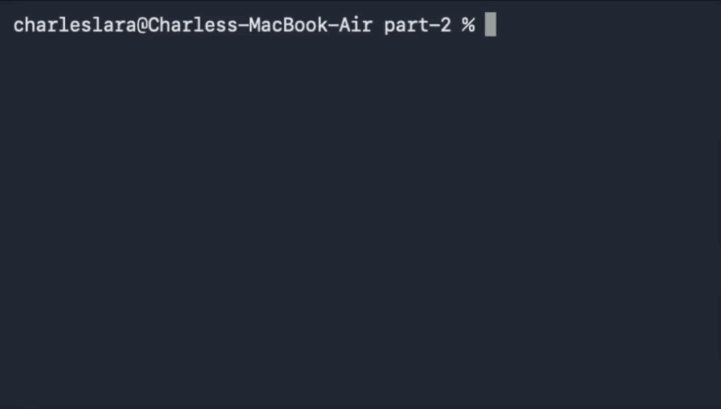

# Charles Lara's Portfolio

This is my home page! My name is Charles Lara and I am a student at [Cal State Fullerton](http://www.fullerton.edu/) and my major is Electrical Engineering.

## Computer Science Projects

My GitHub page is [@charleslaracsu](https://github.com/charleslaracsu).

### CPSC 120

* Lab 7

    Lab 7 part-1 was fun to program. This lab is where we learned std::stoi and std::stod. Using some interesting logic we were able to get the program to tell us when we can park on specific streets. This was one of the programs that really felt more like a puzzle instead of a lab assignment. It was more complex than the other programs that we went though which I liked and added to the puzzle aspect of it.

* Lab 10

    Lab 10 part-1 was one of my favorite programs so far. It incorporates 2D vectors and loops to create a basic program that pulls data off a table and does some math to give a percentage based on the county vs state population. This was one of the programs I felt more confident in my skills. What I liked about this program is that it was one of the first programs we wrote that was somewhat interactive. 

* Lab 11

    Lab 11 part-2 was one of the easier programs to do and the result is pretty satisfying. This lab makes a program that creates a high low game in which the player is trying to guess a value. The value that is being guessed is randomly generated by the program and is a number between 1 and 10. The player is given 4 chances to guess the number by guiding the player based on the number inputed. I liked this program because the reward for writing it was a simple yet fun game to play. 

    

[def]: images/csuf-wordmark.png